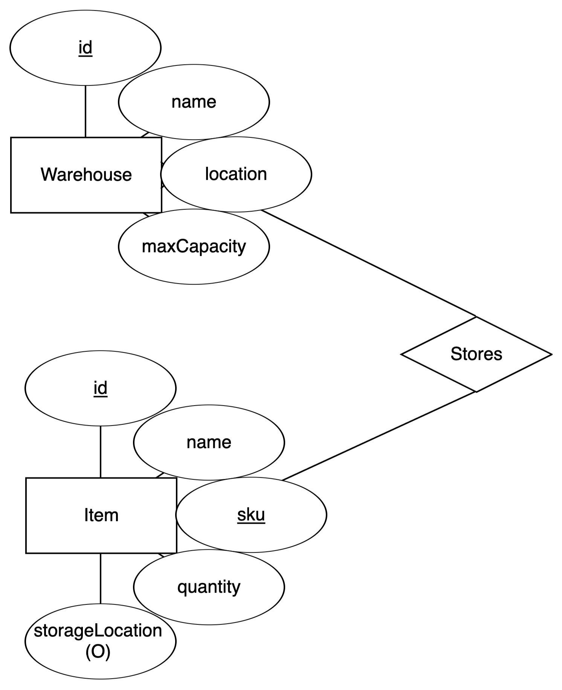
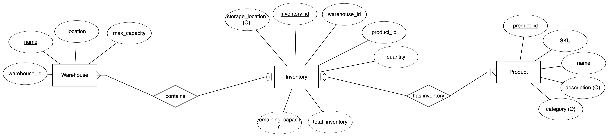

# InventoryManagementSystem
Project 1. Full-Stack

## Data Model
Original: 

In the first version of the project, I created two tables, warehouse and item. Each physical item record belonged to exactly one warehouse through warehouse_id. If the same product SKU existed in three warehouses, the database stored three separate Item rows that repeated the product information. 

Updated:

To better model a true many to many relationship between warehouses and products, I split the data model into three entities: warehouse, product, and inventory. 
A product represents a catalog item, defined once per SKU. A warehouse represents a physical location. Inventory links a specific product to a specific warehouse and tracks how much of that product is stored there. 